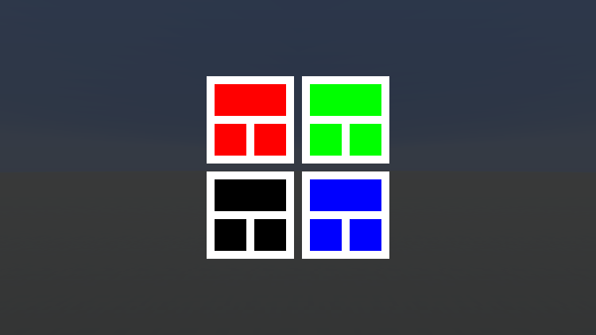

# Squares All the Way Down

## Custom Layer Classes

- For more complex behavior you'll often want to make a custom layer class
  - guidelines for when: encapsulation, separation of concerns, DRY, etc.
```java
~import com.teamwizardry.librarianlib.facade.FacadeScreen;
~import com.teamwizardry.librarianlib.facade.layer.GuiLayer;
~import com.teamwizardry.librarianlib.facade.layers.RectLayer;
~import com.teamwizardry.librarianlib.math.Vec2d;
~import net.minecraft.util.text.TranslationTextComponent;
~
~import java.awt.Color;
~
public class SquaresAllTheWayDownScreen extends FacadeScreen {
    public SquaresAllTheWayDownScreen() {
        super(new TranslationTextComponent("modid.screen.squares_all_the_way_down.title"));

        getMain().setSize(new Vec2d(115, 115));
        getMain().add(new SquareInSquareLayer(Color.RED,   0,  0));
        getMain().add(new SquareInSquareLayer(Color.GREEN, 60, 0));
        getMain().add(new SquareInSquareLayer(Color.BLUE,  60, 60));
        getMain().add(new SquareInSquareLayer(Color.BLACK, 0,  60));
    }

    // Displays a white background with a colored rectangle on the top and two colored
    // squares in the bottom
    private static class SquareInSquareLayer extends GuiLayer {
        public SquareInSquareLayer(Color color, int posX, int posY) {
            super(posX, posY, 55, 55);

            // background
            this.add(new RectLayer(Color.WHITE, 0, 0, 55, 55));

            // top rectangle
            this.add(new RectLayer(color, 5, 5, 45, 20));
            // bottom squares
            this.add(new RectLayer(color, 5,  30, 20, 20));
            this.add(new RectLayer(color, 30, 30, 20, 20));
        }
    }
}
```


