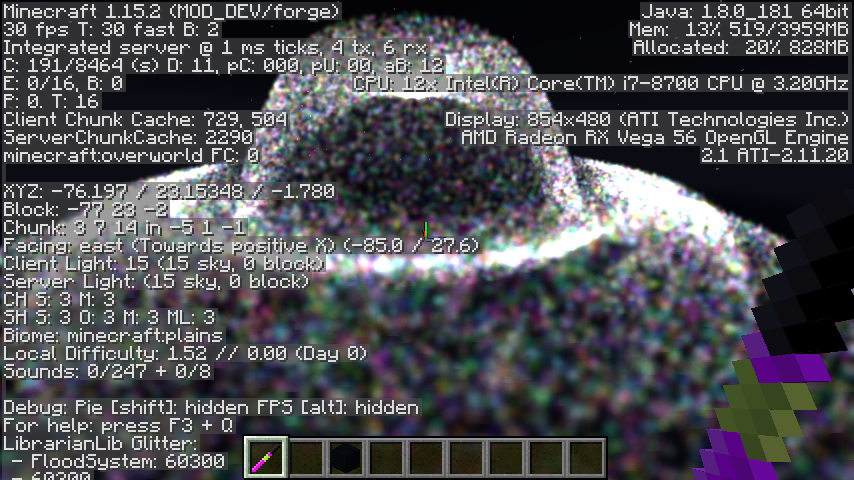
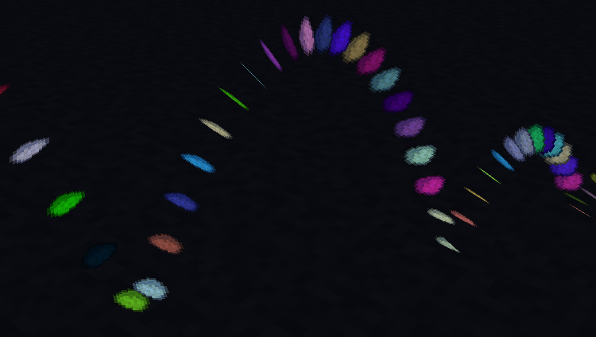

# Glitter

Glitter is LibrarianLib's high-performance particle module, which is inspired primarily by Unreal
Engine's Niagara particle systems.

As an example of the performance, here are over sixty thousand particles with full world
collision running at a solid 30 FPS. Part of the reason the system is so performant is that it's
designed to do everything with nearly zero object allocations, meaning there's barely any memory
churn even with tens of thousands of particles active at once.

<video width="750" autoplay loop><source src="60k_Glitter.mp4" type="video/mp4"></video>


For reference and as an easy jumping off point, here's a complete particle system. All of this
will be explained further down.

```java
~import com.teamwizardry.librarianlib.glitter.ParticleSystem;
~import com.teamwizardry.librarianlib.glitter.bindings.ConstantBinding;
~import com.teamwizardry.librarianlib.glitter.bindings.StoredBinding;
~import com.teamwizardry.librarianlib.glitter.modules.BasicPhysicsUpdateModule;
~import com.teamwizardry.librarianlib.glitter.modules.SpriteRenderModule;
~import net.minecraft.util.ResourceLocation;
~
public class QuickstartSystem extends ParticleSystem {
    @Override
    public void configure() {
        StoredBinding position = bind(3);
        StoredBinding previousPosition = bind(3);
        StoredBinding velocity = bind(3);
        StoredBinding color = bind(4);

        getUpdateModules().add(new BasicPhysicsUpdateModule(
                position, previousPosition, velocity
        ));

        getRenderModules().add(new SpriteRenderModule(
                SpriteRenderModule.simpleRenderType(
                        new ResourceLocation("modid", "textures/particle/sprite.png")
                ),
                position,
                previousPosition,
                color,
                new ConstantBinding(0.25) // size
        ));
    }

    public void spawn(
            double x, double y, double z,
            double vx, double vy, double vz,
            float r, float g, float b, float a
    ) {
        this.addParticle(
                20,         // lifetime
                x, y, z,    // position
                x, y, z,    // previousPosition
                vx, vy, vz, // velocity
                r, g, b, a  // color
        );
    }
}
```

## Systems

Systems are the core of Glitter. They define the data (bindings), behavior (update modules), and
appearance (render modules) of particles. 

Particle systems are configured by overriding the `configure()` method, which may be called
multiple times (reloading textures reloads particle systems, to facilitate hot swapping). There
should only be one instance of a particle system, and it should be registered using the
`addToGame` method.

Particles are created using the protected `addParticle` method. Subclasses should provide custom
`spawn` methods that have meaningful parameters (`addParticle` just accepts a bunch of `double`s
for reasons I'll go into in the next section).

## Bindings

In order for a particle system to do anything useful, each particle needs to hold some data. In
Glitter particles aren't represented by instances of classes, since classes introduce unnecessary
overhead. Instead, each particle is represented as a `double[]`, and bindings provide access and
meaning to those array elements.

Bindings can be created in the `configure()` method using the `bind(int)` method. Each binding
is allocated the specified number of elements in the particle array. However, the only time this
layout will actually matter to you is when spawning particles.

```java
~import com.teamwizardry.librarianlib.glitter.ParticleSystem;
~import com.teamwizardry.librarianlib.glitter.bindings.StoredBinding;
~
public class BindingExampleSystem extends ParticleSystem {
    @Override
    public void configure() {
        StoredBinding position = bind(3);
        StoredBinding color = bind(4);
        
        // The resulting particle array layout: 
        // [
        //     age,
        //     lifetime,
        //     pos, pos, pos,
        //     color, color, color, color
        // ]
    }
}
```

To use a binding, pass the particle array into the binding's `load(double[])` method. Once the
data has been loaded into the binding, it can be accessed from the `getContents()` array. If the
binding is writable then passing the particle into the `store(double[])` method will store the
modified values back into particle array.

Because of this abstraction (using `load`/`store`), bindings don't necessarily have to be
directly accessing values from the particle array. Glitter has a number of built in bindings that
do more than directly index into the particles. 

- `ConstantBinding`  
  One of the more common bindings
- `EaseBinding`  
  This will ease between two values based on the contents of other bindings
- `PathBinding`  
  This will ease a value along a `ParticlePath` (e.g. `BezierPath` and `EllipsePath`)
- `VariableBinding`  
  A binding that can store temporary state for use between multiple modules.

## Update Modules

Without update modules, the most a particle can do is exist in a current state. It can't move,
change color, or really change at all. Every tick, each particle is passed to the configured
update modules for processing. (e.g. particle 0 will be passed to modules A, B, then C, then
particle 1 will be passed to modules A, B, then C, …)

The most commonly used update module is the `BasicPhysicsUpdateModule`. This module handles
everything needed for most physics-based particles, including gravitational acceleration, block
collision, bouncing, and friction. All these parameters are configurable through bindings, but have
sensible defaults that you likely won't need to change.

```java
~import com.teamwizardry.librarianlib.glitter.ParticleSystem;
~import com.teamwizardry.librarianlib.glitter.bindings.StoredBinding;
~import com.teamwizardry.librarianlib.glitter.modules.BasicPhysicsUpdateModule;
~
public class BasicPhysicsExampleSystem extends ParticleSystem {
    @Override
    public void configure() {
        StoredBinding position = bind(3);
        StoredBinding previousPosition = bind(3);
        StoredBinding velocity = bind(3);

        getUpdateModules().add(new BasicPhysicsUpdateModule(
                position, previousPosition, velocity
        ));
    }
}
```

## Render Modules

Render modules are what take your particles and render them on the screen. A system can have any
number of render modules, meaning you can overlay multiple render effects on top of each other
(e.g. an opaque sprite with an additive halo sprite).

You can either implement your own or use the built-in `SpriteRenderModule`. At its simplest, the
`SpriteRenderModule` takes just a render type and position binding. The next two optional
parameters—particle color and particle size—are the most commonly used ones, but it has several 
other useful features.

```java
~import com.teamwizardry.librarianlib.glitter.ParticleSystem;
~import com.teamwizardry.librarianlib.glitter.bindings.ConstantBinding;
~import com.teamwizardry.librarianlib.glitter.bindings.StoredBinding;
~import com.teamwizardry.librarianlib.glitter.modules.SpriteRenderModule;
~import net.minecraft.util.ResourceLocation;
~
public class SpriteRenderExampleSystem extends ParticleSystem {
    @Override
    public void configure() {
        StoredBinding position = bind(3);
        StoredBinding previousPosition = bind(3);
        StoredBinding color = bind(4);

        getRenderModules().add(new SpriteRenderModule(
                SpriteRenderModule.simpleRenderType(
                        new ResourceLocation("modid", "textures/particle/sprite.png")
                ),
                position,
                previousPosition,
                color,
                new ConstantBinding(0.25) // size
        ));
    }
}
```

### Advanced `SpriteRenderModule` Features

#### Alpha Multiplier
The easiest to understand would be the `alphaMultiplier`. This acts as an additional modifier on
the color's alpha channel, allowing easier opacity manipulation.

#### Facing Vector
One of the most interesting features of the sprite renderer is support for particles with sprites
that don't directly face the player. By default, sprites are always rotated such that they face
directly toward the camera, essentially appearing 2D. However, by passing a custom 3D binding for
the `facingVector`, particles can be made to face any direction you want. By a fortunate quirk of
the math, the facing vector doesn't even need to be normalized.

In this example I've set the facing vector to the velocity binding.



#### Sprite Sheet

Often you'll have a large number of particle systems that are identical in every way except the
texture. It can be tedious, repetitive, and downright inefficient to have separate systems for
each texture, so the `SpriteRenderModule` has two parameters to fix that: the `spriteSheetSize`
and the `spriteSheetIndex` binding. The sprite sheet size must be a power of two (2, 4, 8, ...),
and the sprite sheet index is an index in left to right, top to bottom order. This index can even
be an `EaseBinding` to support animations.

## Depth Sorting & Other Modules

There are two other types of modules which are more rarely used: global update modules
(`getGlobalUpdateModules()`) and render prep modules (`getRenderPrepModules()`). The
`DepthSortModule` is a global update module, and likely the one you'll use most.

### Global Update Modules

Global update modules are given the entire backing list of particles before each frame, and are
useful for things like depth sorting.

### Render Prep Modules

These modules are identical to update modules, but are run during the render phase. These have
limited usefulness, but are available if you need them. Note that frames are often rendered much
faster than the tick rate, and their impact gets larger and larger the higher the frame rate, so
these modules are even more performance critical than the update modules.
